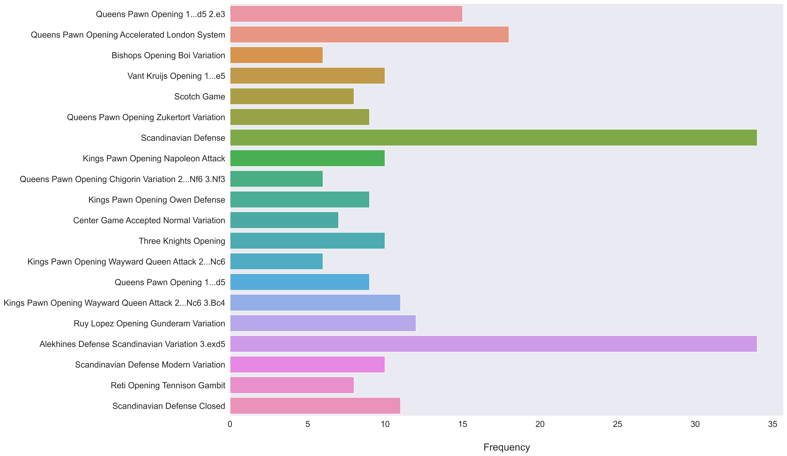

# Statistical Analysis of a Chess Player using Data Science Pipeline

## About The Project

Chess is a game with infinite possibilities and every game played produces large amounts of data. This project aims to provide chess enthusiasts a tool to improve their game with assistance from several Machine Learning and Data Science techniques, by studying their previous games.

## Objectives
* Finding the player’s Strengths and Weaknesses.
* Detailed analysis of your opponents moves before the match.
* Next move Predictions based on previous games played.
* See the least and most favourite Chess Opening Lines.
* Find which moves attributed to Wins , Losses or Draws.
* Visualising the statistics related to the account in great detail.
* Help the player improve their endgames.
* Play a Live game and get the analysis of the game in real-time.

## Navigation

* This is the screenshot of the Home Page of the App. On the top are the tabs which the user can click to access different context functions in the App.
 

  
  

  

* For a complete Data Analysis, you must go to User Input tab and enter your Chess.com username and click on Request Analysis. The application will take some time to retrieve your data through the Chess.com API.

 

  
  
 
  
* Once done, you will receive a dialog saying successful. Click on Ok and go to the Player Analysis Tab. Here you will see all the visualized data in detail.

 

  
  
 
  
 

  
  
  
  
 

  
  
  
  
* To predict what is the probability that one of the two players will win against the other, go to the game predictions tab. Here, enter you and your opponent's Chess.com username and click on the request analysis button. This will build a logistic regression model based on both the players' historical wins against opponents of different ELO ratings. Once done, you can scroll down to see the probability of winning and the accuracy of the model. Note that, more the games played on your Chess.com account, more will be the model's accuracy, as more data will be available for an accurate prediction.

 

  
  
  

 

  
  
  
 
  

  
  
  
 
* This is the about page giving credit to people who really helped me out with their tutorials.

  

  
  
 
 

## Types of Analysis available :

1. Frequency Countplot of the different openings played as White :

  

  
  
  
  
2. Frequency Countplot of the different defences played as Black :

  

  
  
  

The keyword "Mark" was provided as a search term and that yielded the following results : 

 

  
  
 

### Built With
The following libraries and frameworks were used in the making of this Project.
* [Python Imaging Library (PIL)](https://pypi.org/project/Pillow/)
* [CairoSVG](https://pypi.org/project/CairoSVG/)
* [Tkinter](https://docs.python.org/3/library/tkinter.html)
* [ZipFile](https://docs.python.org/3/library/zipfile.html)
* [Python Requests Module](https://docs.python-requests.org/)
* [Pandas](https://pandas.pydata.org/)
* [Seaborn](https://seaborn.pydata.org/)
* [Matplotlib](https://matplotlib.org/)
* [Plotly](https://plotly.com/)
* [Python Chess Library](https://python-chess.readthedocs.io/en/latest/pgn.html)
* [Scikit Learn](https://scikit-learn.org/)
* [Python Mord](https://pypi.org/project/mord/)
* 

